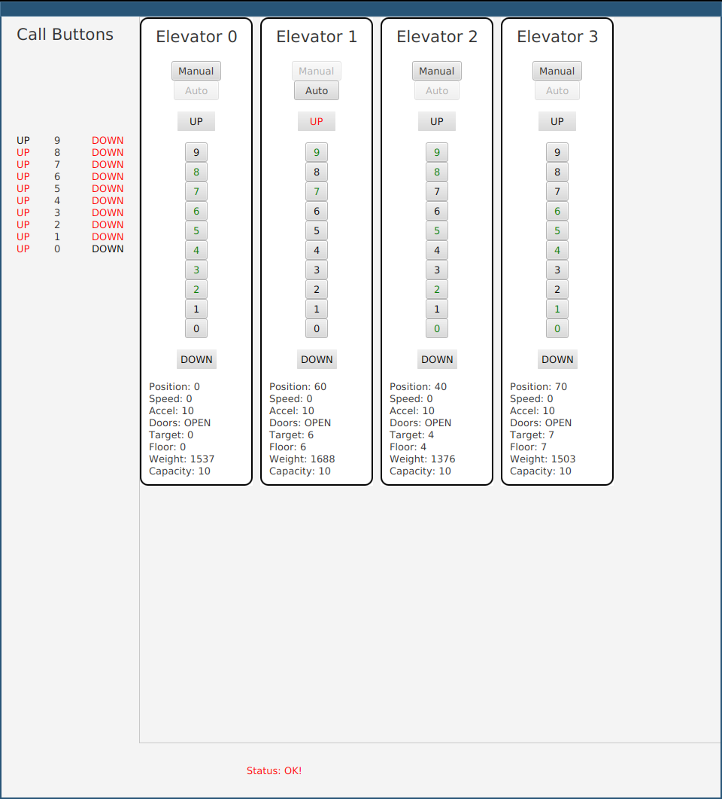

# Elevator Control Center using RMI and JavaFx

## Running the application
### Requirements
The RMI service for the hardware controller to query must be started beforehand (see separate project).

### Starting the application from source code
Then, the application can be started with the maven command javafx:run. This calls the main function in ``src/main/java/at/fhhagenberg/sqe/ecc/ElevatorMain.java``
If everything works correctly, a GUI similar to the following image should appear.

On the left are up and down button states for every possible floor. To the right, all elevators are listed.
Called floors are shown with green buttons, while unserviced floors have inactive buttons. Manual and automatic mode can be switched at the very top.
Below the buttons, labels with information about the elevator status are shown. At the very buttom of the GUI window, status messages can appear.

### Starting the application from release
To start the final release, just download the ecc-team-e-0.0.1-SNAPSHOT.jar file from the Release Assets.
You can start this application with
```
java -jar ecc-team-e-0.0.1-SNAPSHOT.jar
```

## Tests
### Unit tests
Unit tests using JUnit can be found in ``test/java/...``
These tests use boundary values to test many scenarios with a minimum number of test cases to maintain.
Mockito is used for simple mocks.

### End-to-End test
An end-to-end test can be found in ``src/test/java/at/fhhagenberg/sqe/ecc/MockedEndToEndTest.java``
It provides a mocked backend to display dummy values in the GUI.
